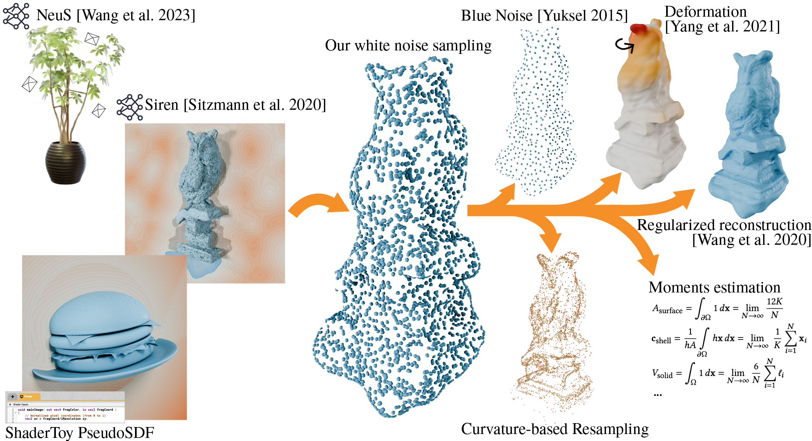

# Uniform Sampling of Surfaces by Casting Rays [SGP 2025]


### [Paper](https://arxiv.org/pdf/2506.05268) 

[Selena Ling](https://iszihan.github.io/),
[Abhishek Madan](https://www.dgp.toronto.edu/~amadan/),
[Nicholas Sharp](https://nmwsharp.com/)
[Alec Jacobson](https://www.cs.toronto.edu/~jacobson/)<br>
Eurographics Symposium on Geometry Processing 2025

## Get started
We provide the code as a library. To install, you need to clone this repo, and run
```
pip install .
```

Then to acquire a uniform set of samples with your implicit surface function in your scripts, you can follow this example: 
```
from ImplicitUniformSampler import ImplicitUniformSampler

sampler = ImplicitUniformSampler()
samples = sampler.sample(sdf_func, num_rays=2000)

# Optional: save sampled points to local.
pcd = o3d.geometry.PointCloud()
pcd.points = o3d.utility.Vector3dVector(samples.detach().cpu().numpy())
o3d.io.write_point_cloud("outputs.ply", pcd)
```

## SDFStudio Example 
We provide an example of using our library with SDFStudio in the submodule ``example/sdfstudio``.

To run this example, you need to set up the enviroment following instructions in their official [repo](https://github.com/autonomousvision/sdfstudio), and run 
```
git submodule update --init --recursive
cd example/sdfstudio 
pip install .
ns-download-data sdfstudio 
```

Download a pre-trained checkpoint from [here](https://drive.google.com/file/d/1sex9CaSjGEWddhBtHvvxCxBDSrlYAW_X/view?usp=sharing) and store it under ``./outputs``.

And finally run
```
ns-export uniformsamples --load-config outputs/data-sdfstudio-demo-data-dtu-scan65/neus/2025-02-21_143619/config.yml --output-dir outputs/data-sdfstudio-demo-data-dtu-scan65/neus/2025-02-21_143619
```
to get the sampled point cloud as a ``.ply`` file.